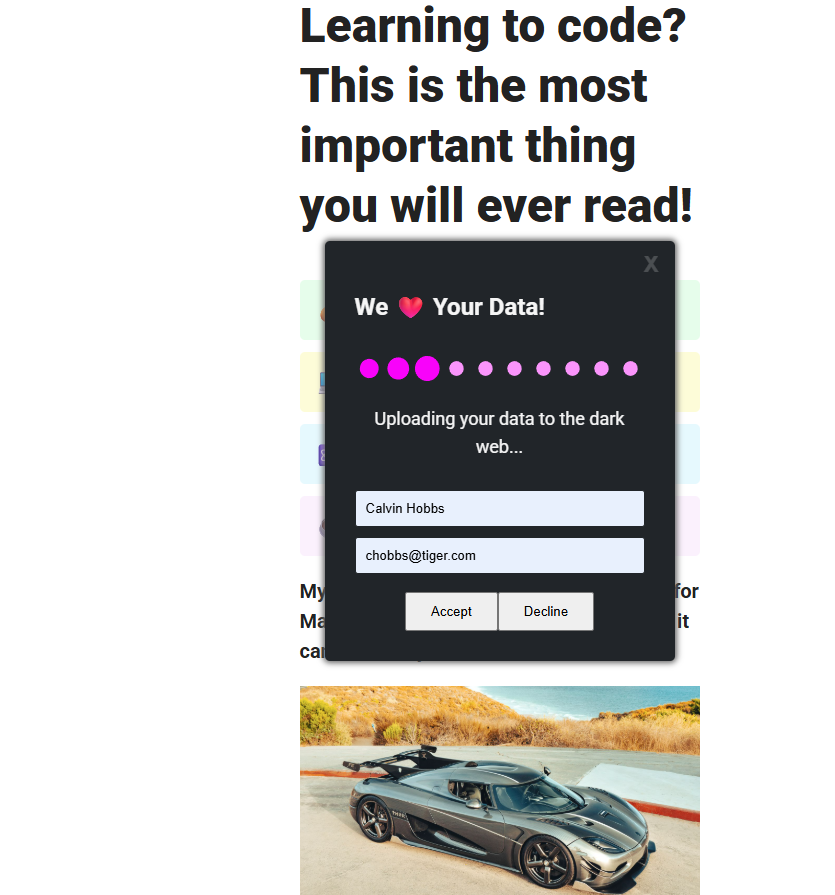

# Scammy Coding Course Landing Page

A satirical web project that parodies deceptive online marketing tactics and sketchy data collection practices commonly found on dubious coding course websites.





## 📝 Live Demo

Check out the worst cookie consent: [https://kvothe1387.github.io/worst-cookie-consent/](https://kvothe1387.github.io/worst-cookie-consent/)

## 🎭 About This Project

This is a **parody/educational project** that demonstrates:
- Misleading marketing claims (learn React in 10 minutes, etc.)
- Deceptive UX patterns (buttons that move on hover)
- Fake progress indicators and loading states
- Humorous takes on data harvesting practices

**⚠️ This is NOT a real coding course and is intended for educational/entertainment purposes only.**

## 🚀 Features

- **Fake Marketing Claims**: Outrageous promises about learning programming languages instantly
- **Deceptive Modal**: A consent form that admits to tracking and spamming users
- **Moving Decline Button**: The "Decline" button switches positions when hovered over
- **Fake Loading Process**: Simulated data upload with humorous messages
- **Satirical Conclusion**: A cheeky reveal after form submission

## 🛠️ Technical Implementation

### Files Structure
```
├── index.html          # Main HTML structure
├── index.css           # Styling and layout
├── index.js            # Interactive functionality
└── images/             # Required image assets
    ├── koenigsegg.jpg  # Hero image
    ├── loading.svg     # Loading animation
    └── pirate.gif      # Final reveal image
```

### Key Components

#### HTML Structure
- Responsive main content with fake course benefits
- Modal overlay with consent form
- Form inputs for name and email collection

#### CSS Features
- Clean, modern typography using Roboto font
- Colorful benefit cards with different background colors
- Modal styling with dark theme
- Button hover effects and animations

#### JavaScript Functionality
- **Auto-modal Display**: Modal appears after 1.5 seconds
- **Button Switching**: Decline button moves on hover using CSS class toggle
- **Form Submission**: Prevents default submission and shows fake loading
- **Timed Messages**: Sequential fake progress messages
- **Dynamic Content**: Updates modal content after "processing"

## 🎯 Educational Value

This project demonstrates:
- **Dark UX Patterns**: How websites manipulate users
- **Form Handling**: Basic form submission and data extraction
- **DOM Manipulation**: Dynamic content updates with JavaScript
- **CSS Animations**: Hover effects and transitions
- **Timing Functions**: Using `setTimeout` for sequential actions

## 🚦 Setup Instructions

1. **Clone or Download** the project files
2. **Add Required Images** to the `images/` folder:
   - `koenigsegg.jpg` (hero/luxury car image)
   - `loading.svg` (loading spinner animation)
   - `pirate.gif` (final reveal animation)
3. **Open `index.html`** in a web browser
4. **Wait for the modal** to appear automatically
5. **Interact with the form** to see the satirical sequence

## 🎨 Customization Options

### Colors
The project uses a color-coded system for benefit cards:
- `.li-green`: Light green background (`#E5FDEA`)
- `.li-yellow`: Light yellow background (`#FCFDD6`)
- `.li-blue`: Light blue background (`#E5F9FE`)
- `.li-pink`: Light pink background (`#FCF1FE`)

### Timing
Adjust the timing of various elements:
- Modal appearance: Change `1500` in the initial `setTimeout`
- Loading messages: Modify the `1500` and `3000` values in form submission

### Content
Easily modify the satirical claims in the HTML or update the fake loading messages in the JavaScript.

## 📝 Code Quality Notes

- Uses vanilla JavaScript (no frameworks)
- Semantic HTML structure
- Separation of concerns (HTML, CSS, JS in separate files)
- Event-driven programming patterns
- DOM manipulation best practices

## 🔧 Potential Improvements

- Add proper error handling
- Implement better mobile responsive design
- Include accessibility improvements
- Add keyboard navigation support
- Create fallback content for missing images
- Add more sophisticated animations

## 📚 Learning Objectives

Perfect for understanding:
- Basic web development fundamentals
- Form handling and validation
- DOM manipulation techniques
- CSS styling and animations
- JavaScript event handling
- UX pattern recognition

## ⚖️ Legal Disclaimer

This project is for educational purposes only. It parodies deceptive marketing practices and should not be used as a template for actual commercial websites. Always follow ethical web development practices and respect user privacy.

## 🤝 Contributing

This is a demonstration project, but feel free to:
- Fix bugs or improve code quality
- Add more satirical elements
- Enhance accessibility features
- Improve mobile responsiveness

---

**Remember**: This is a parody project highlighting problematic web practices. Use it to learn about both good and bad UX patterns!